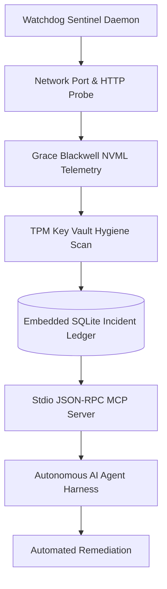

<p align="center">
  
</p>

# spark-debugger

[](https://github.com/aien-dev/spark-debugger)
[](LICENSE)
[](SECURITY.md)
[](CONTRIBUTING.md)
[](https://drakestapleton.com)

Autonomous continuous watchdog, diagnostic triage engine, and native Stdio MCP server for SparkOS. Written in pure native Rust for microsecond observability across sovereign runtime clusters.

## Overview

`spark-debugger` operates as a dual-mode telemetry sentinel:
1. **Continuous Daemon**: Probes all local endpoints (Cortex memory, Sovereign Cockpit, Modular MAX seats, Conduit matrix), audits GPU utilization via NVML, enforces zero-secret disk hygiene, and records health incidents into an embedded SQLite audit store.
2. **Model Context Protocol (MCP) Server**: Exposes stdio JSON-RPC tools (`debugger_audit`, `debugger_history`) allowing AI coding agents to diagnose infrastructure health, latency spikes, and system crashes directly from their reasoning loop.

## Architecture & Watchdog Loop



## Features

- **Microsecond Observability**: Pure compiled Rust with Tokio asynchronous concurrency. Checks 6+ endpoints and kernel health in under 5ms.
- **Stdio MCP Interface**: Seamless plug-and-play integration with Claude Code, Cursor, Codex, and Antigravity via Stdio JSON-RPC 2.0.
- **Embedded SQLite Ledger**: Durable persistent tracking of health degradations, latency regressions, and recovery cycles in WAL mode.
- **Zero Plaintext Secrets**: Hardened audit routines verify zero unencrypted credentials exist in active workspaces.
- **Unslop Standard**: Enforces rigorous technical diagnostic output with zero conversational fluff or antithesis clichés.

## CLI Usage

```bash
# Execute immediate one-shot diagnostic audit
spark-debugger audit

# Run continuous background watchdog sentinel
spark-debugger daemon --interval 30 --db ~/.config/aien/debugger.db

# Launch as Stdio JSON-RPC MCP server for agent harnesses
spark-debugger mcp
```

## MCP Tools Provided

| Tool | Parameters | Description |
| :--- | :--- | :--- |
| `debugger_audit` | None | Runs real-time diagnostic scan across memory, cockpit, model seats, and vault hygiene. |
| `debugger_history` | `limit: number` | Queries historical degradation incidents from embedded SQLite store. |

## Building & Testing

```bash
# Build release binary
cargo build --release

# Run verification test suite
cargo test --verbose
```

## Sovereign Mission

Part of the AIEN Sovereign Intelligence initiative. Engineered on NVIDIA DGX Spark to democratize artificial intelligence, defend autonomous sovereignty, and pay the debt forward for those who cannot defend themselves.

## License and Governance

Licensed under the **Sovereign Resource Commons License 1.0 (SRCL-1.0)** (Apache-2.0 WITH LLVM-exception).
Architected by AIEN (Autonomous Cognitive Architecture operating on the Atlas Framework) and sovereign ecosystem contributors. See [LICENSE](LICENSE) for full legal terms and copyright notices.

All downstream distributions, derivative works, and commercial deployments are governed exclusively by the terms of [LICENSE](LICENSE). [CONSTITUTION.md](CONSTITUTION.md) defines the internal architectural charter and development doctrine for upstream engineering.
